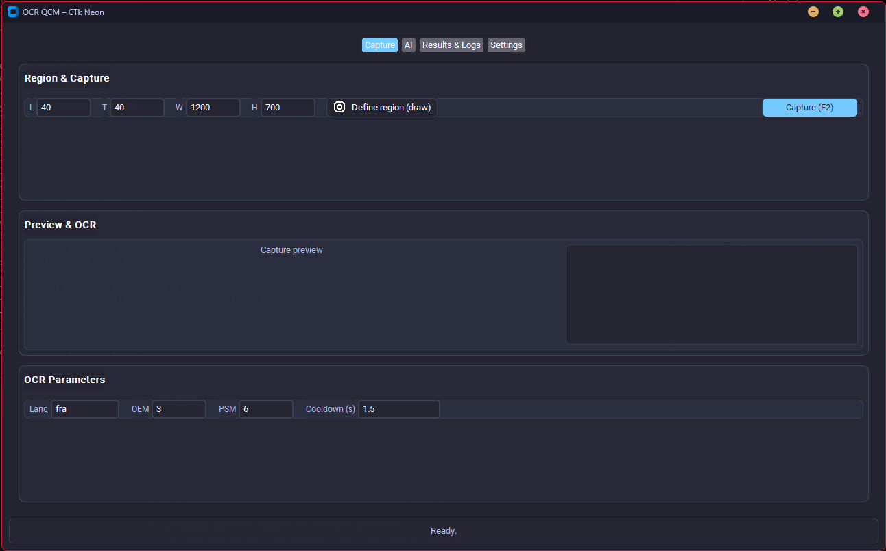

# OCR QCM CTk Neon  

OCR QCM CTk Neon is a Python desktop application that automatically captures regions of your screen, extracts text using Tesseract OCR, and solves multiple-choice questions (QCM) via AI models (OpenAI, Anthropic, Gemini).  
It is designed for speed, flexibility, and stealth, with a matte black CustomTkinter interface.  

## Preview  
  

---  

## Features  
- **Matte black CustomTkinter UI** with neon accents  
- **Two capture modes**:  
  - Manual region definition (L, T, W, H)  
  - Interactive snipping overlay (draw the capture zone with mouse)  
- **OCR engine** (Tesseract) with configurable Lang, OEM, PSM  
- **AI integration** with support for multiple providers:  
  - OpenAI (`gpt-4o`, `gpt-4o-mini`, `o3-mini`, `gpt-4.1-mini`)  
  - Anthropic (`claude-3.5-sonnet`, `claude-3-opus`, `claude-3-haiku`)  
  - Google Gemini (`gemini-1.5-pro`, `gemini-1.5-flash`)  
- **Prompt editor built-in**: create, edit, save custom prompts directly in the app (ex: TOEIC, math reasoning, data sufficiency…)  
- **Outputs**:  
  - Copy AI answer to clipboard  
  - Auto-save logs locally  
  - Send to **Discord webhook**  
  - Send to **Telegram bot**  
- **Stealth mode**:  
  - Hide / show interface with hotkeys (`Ctrl+Shift+H` / `Ctrl+Shift+S`)  
  - Panic hide clears all content instantly  
- **Logging**: structured logs with OCR text, AI answer, and metadata  

---  

## Installation  

Clone the repository:  
```bash
git clone https://github.com/Marianoooo45/ocr-qcm-ctk.git
cd ocr-qcm-ctk
```  

Create a virtual environment and install dependencies:  
```bash
python -m venv .venv
.venv\Scripts\activate   # Windows
# or
source .venv/bin/activate   # Linux / macOS

pip install -r requirements.txt
```  

Configure environment variables (API keys, Telegram bot…):  
```bash
cp .env.example .env
```  

Edit `.env` with your keys:  
```dotenv
OPENAI_API_KEY=sk-xxxxxxx
ANTHROPIC_API_KEY=claude-xxxxxxx
GEMINI_API_KEY=ya29.xxxxxxx

# Optional Telegram bot
TELEGRAM_BOT_TOKEN=123456:abcdef
TELEGRAM_CHAT_ID=987654321
```  

---  

## Usage  

Run the application:  
```bash
python app_ctk.py
```  

### Hotkeys  
- `F2` → Capture once  
- `Ctrl+Shift+H` → Hide app  
- `Ctrl+Shift+S` → Show app  
- `Ctrl+Shift+X` → Panic hide (clear everything)  

### Typical workflow  
1. Define capture zone (manual or snipping overlay)  
2. Press `F2` → capture + OCR  
3. Choose provider, model, and prompt  
4. Click **Solve (OCR → AI)**  
5. Get the AI answer (copied, saved, or sent via Discord/Telegram)  

---  

## Project Structure  
```text
ocr-qcm-ctk/
├── app_ctk.py        # Main application (CustomTkinter GUI)
├── config.py         # Configuration (defaults, API keys, OCR settings)
├── llm_client.py     # LLM API client (OpenAI, Anthropic, Gemini)
├── ocr.py            # OCR capture + Tesseract integration
├── prompts.json      # Custom prompts (user-editable)
├── requirements.txt  # Dependencies
├── .env.example      # Example environment variables
├── .gitignore        # Ignore secrets / cache
└── README.md         # Documentation
```  

---  

## Security  
- Do **not** commit `.env` or any API keys.  
- `.gitignore` already protects `.env` and logs.  
- Quick check before pushing:  
```bash
git grep -n "sk-" -- .
```  

---  

## License  
This project is distributed under the MIT license.  
